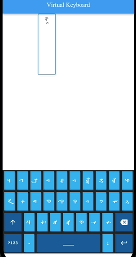
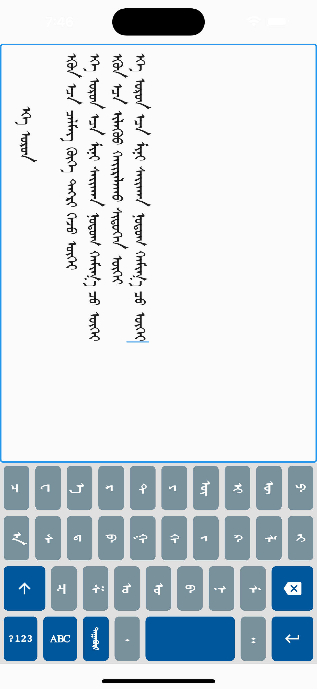

# Mongol Virtual Keyboard

A Flutter virtual keyboard implementation for Traditional Mongolian script, built with ClojureDart (cljd). This project provides a customizable virtual keyboard that supports Mongolian text input with FST-based word prediction and candidate suggestions.

## Features

- **Mongolian Script Support**: Full support for Traditional Mongolian vertical script input
- **FST-based Word Prediction**: Intelligent word completion using Finite State Transducer technology
- **Customizable Layout**: Flexible keyboard layout system with multiple styling options
- **Emoji Support**: Built-in emoji picker integration
- **Haptic Feedback**: Vibration feedback for key presses
- **Cross-platform**: Works on iOS, Android, Web, Linux, macOS, and Windows

## Screenshots

### Basic Keyboard


### Styled Keyboard


## Getting Started

### Prerequisites

- Flutter SDK (3.8.1 or higher)
- Clojure CLI (`clj` command)
- ClojureDart (`cljd`)

### Installation

1. Install the Clojure CLI tool (`clj` command)
   - See [Clojure CLI installation guide](https://clojure.org/guides/install_clojure)

2. Initialize the ClojureDart project:
   ```bash
   clj -M:cljd init
   ```

3. Restore the project configuration:
   ```bash
   cp pubspec.yaml.bak pubspec.yaml
   ```

### Running the Example

1. Start a simulator (iOS):
   ```bash
   open -a Simulator
   ```

2. Run the Flutter app:
   ```bash
   clj -M:cljd flutter
   ```

For Android, you can use an Android emulator or connect a physical device.

## Project Structure

```
src/virtual_keyboard/
├── example/          # Example implementations
├── keyboard.cljd     # Main keyboard component
├── keyboard_layouts.cljd  # Keyboard layout definitions
├── keyboard_state.cljd    # State management
├── keyboard_candidates.cljd # Candidate word suggestions
├── fst_reader.cljd   # FST dictionary reader
└── ...               # Additional utilities and components
```

## Technology Stack

- **Flutter**: Cross-platform UI framework
- **ClojureDart (cljd)**: Clojure language for Flutter development
- **FST**: Finite State Transducer for word prediction
- **Mongolian Script Libraries**: Integration with mongol and mongol_code packages

## Dependencies

Key dependencies include:
- `mongol: ^9.0.0` - Mongolian vertical script widgets
- `mongol_code: ^1.0.4` - Unicode conversion for Mongolian script
- `emoji_picker_flutter: ^4.3.0` - Emoji picker functionality
- `vibration: ^3.1.4` - Haptic feedback
- `path_provider: ^2.1.5` - File system access

See `pubspec.yaml` for the complete list of dependencies.

## Credits

Mongolian Flutter Apps are made possible by the following open-source projects:

- [suragch/mongol](https://github.com/suragch/mongol) - Mongolian vertical script widgets for Flutter apps
- [suragch/mongol_code](https://github.com/suragch/mongol_code) - Unicode conversion library for traditional Mongolian script

## Roadmap

- [ ] Support English key layout
- [ ] Support displaying candidates list & suffix list
- [ ] Support saving active words to SQLite with query functionality when typing matches

## License

This project is available for private use. See `pubspec.yaml` for publishing configuration.

## Contributing

Contributions are welcome! Please feel free to submit issues or pull requests.

## Resources

- [Flutter Documentation](https://docs.flutter.dev/)
- [ClojureDart Documentation](https://cljd-docs.tech/)
- [Mongolian Script on Wikipedia](https://en.wikipedia.org/wiki/Mongolian_script)